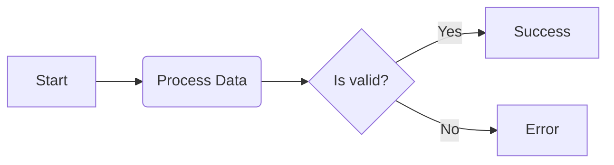
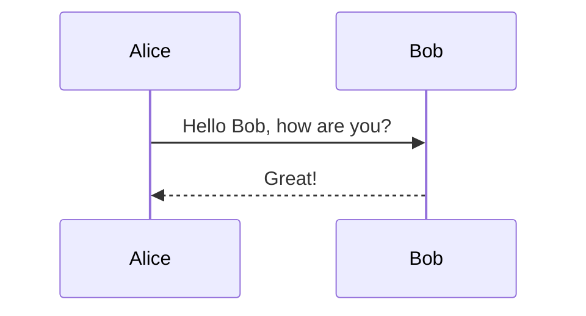

## Flowchart (Left-to-Right)

```mermaid

flowchart LR
    A[Start] --> B(Process Data)
    B --> C{Is valid?}
    C -- Yes --> D[Success]
    C -- No --> E[Error]

```

## Sequence Diagram

```mermaid
sequenceDiagram
    Alice ->> Bob: Hello Bob, how are you?
    Bob -->> Alice: Great!
```
